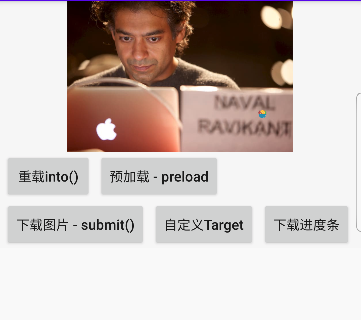
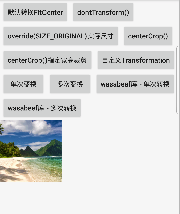

本包目录包括约束布局Glide所有案例，从GlideMainActivity是所有案例的总入口。参考文献：

[项目中都案例参考地址(基础)](https://juejin.im/entry/5ad5555f51882555867fe935)

[郭霖的专栏("Android图片加载框架最全解析"系列教程)，涉及源码讲解，非常推荐！](https://blog.csdn.net/guolin_blog/article/details/53759439)

[快速上手的Glide4.x教程](https://juejin.im/post/5abf73e66fb9a028b54802f7)

[Glide各种Transformation案例](https://github.com/wasabeef/glide-transformations)

### 源码
[Glide 源码解析之流程剖析 - 有部分流程图](https://juejin.im/post/5a7a9c255188257a654cc107)

[Glide核心设计一：皮皮虾，我们走 - 强调重要的类](https://juejin.im/post/58abfbe95c497d005f732e0d)

[Glide 核心设计二: 缓存管理](https://juejin.im/post/58b42cb9ac502e0069e0e370)

[Glide4 源码解析--框架初始化](https://juejin.im/entry/5abf35d75188251fc32965d6)

[从源码角度深入理解Glide4（上）- 有一张很全的请求流程图](https://juejin.im/post/5c519ff86fb9a049e2326c98)

[从源码角度深入理解Glide4（下）- 有流程图](https://juejin.im/post/5c6a3a386fb9a049f9131e95)

  

  

  

  